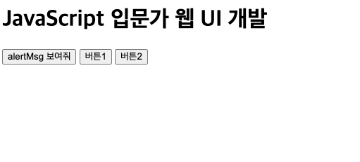
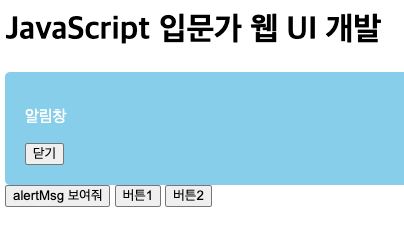
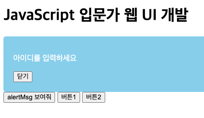
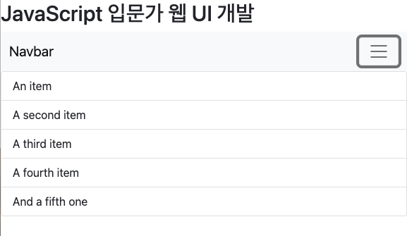

# 코딩애플 JavaScript 입문과 웹 UI 개발 + Svelte.js [Core API] 완벽 가이드
## level1
### 1. alert-box 

1. html부분에서 script에서 만든 함수를 사용할 때, parameter를 대입하고싶다.  
```javascript
    function look(state){
    document.getElementById('alert').style.display = state;
    }
```
```html
    <button on:click={look('block')}> 보여줘 </button>
```
-> 먹통
-> 해결: 원하는 기능이 익명함수 내에서 실행되도록함. 
```html
    <button on:click={()=>{look('block')}}> 보여줘</button>
```




### 2. submenu
1. 스벨트에서 부트스트랩 사용하기. 
```sveltehtml
<script src="https://cdn.jsdelivr.net/npm/bootstrap@5.1.3/dist/js/bootstrap.bundle.min.js" integrity="sha384-ka7Sk0Gln4gmtz2MlQnikT1wXgYsOg+OMhuP+IlRH9sENBO0LRn5q+8nbTov4+1p" crossorigin="anonymous">

</script>

<svelte:head>
    <!-- Bootstrap CSS -->
    <link href="https://cdn.jsdelivr.net/npm/bootstrap@5.1.3/dist/css/bootstrap.min.css"
          rel="stylesheet"
          integrity="sha384-1BmE4kWBq78iYhFldvKuhfTAU6auU8tT94WrHftjDbrCEXSU1oBoqyl2QvZ6jIW3"
          crossorigin="anonymous">

    <title>submenu</title>
</svelte:head>
```
2. class 탈부착 (classList), querySelector
```javascript
function submenuToggle(){
    document.querySelectorAll('.list-group')[0].classList.toggle('show');
}
```
- 클래스 list-group를 가진 요소 중 제일 첫 요소에서, show class를 toggle하세요. (show가 있다면 제거, 없다면 추가)

3. TODO: `<ul class="list-group show">`에 show를 처음부터 추가했을 땐 toggle기능이 정상적으로 동작하지만, 추가하지 않았을 땐 속성 검사 시 show성분이 보이지 않음. 
- 


### 3. modal
1. jquery 사용시 장점. : 코드가 짧아짐.
```javascript
   document.querySelectorAll('.className')[0].innerHTML = '바보';
   //jquery
   $('className')[0].innerHTML='바보';
```

2. one-way 애니메이션
    1. 시작스타일 만들기
   2. 최종 스타일 만들기
   3. 원할 때 최종스타일로 변하라고 JS코드 짜기
   4. 시작스타일에 transition 추가. 
   - 스벨트에서의 애니메이션

3. display속성이 처음에 보이지 않을 경우, toggle해도 보이지 않는 문제 해결